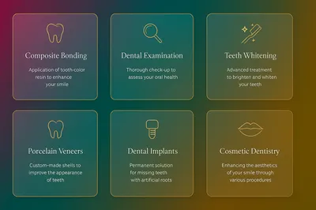
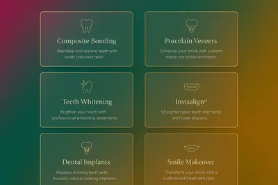
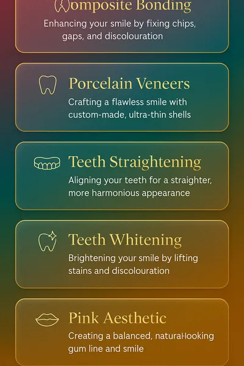

# Signature Services Grid v2 — Design Asset Drop

**Manus AI Visual Design Deliverable**  
**Date**: October 31, 2025  
**Brand System**: Champagne Design System  
**Repository**: drnickmaxwell-wq/please-work-again

---

## Overview

This asset drop provides visual design resources for a premium 6-card services grid section featuring the Champagne Design System's signature glass morphism treatment, gold accent keylines, and responsive layouts across desktop, tablet, and mobile breakpoints.

## Visual Previews

### Desktop Layout (1440×900)


**3-column grid** with 2 rows, showcasing all 6 services with generous spacing and glass treatment.

### Tablet Layout (1024×768)


**2-column grid** with 3 rows, optimized for tablet viewing with balanced card proportions.

### Mobile Layout (390×844)


**Single-column stack** with touch-friendly spacing and vertical flow.

---

## Assets Included

### Icons (SVG)
Six minimalist line icons at 24×24 viewBox:

- `dental-implants.svg` — Implant with screw thread detail
- `same-day-crowns.svg` — Star crown representing premium service
- `invisalign-aligners.svg` — Circular aligner with alignment markers
- `composite-bonding.svg` — Sparkle stars for cosmetic enhancement
- `hygiene-airflow.svg` — Radial cleaning icon
- `emergency-care.svg` — Medical cross in circle

All icons use `currentColor` for flexible theming.

### Screenshots (WEBP)
Three responsive layout mockups at 85% quality:

- `desktop-1440x900.webp` (1440×900)
- `tablet-1024x768.webp` (1024×768)
- `mobile-390x844.webp` (390×844)

Plus thumbnail versions (`*-thumb.webp`) at 400px width for documentation.

### Metadata
- `manifest.json` — Complete asset catalog with design specifications
- `README.md` — This documentation file

---

## Design Specifications

### Glass Treatment
- **Background**: Frosted glass with subtle transparency
- **Border**: 1px gold accent (#D4AF37 from brand tokens)
- **Border Radius**: 16-20px for soft, rounded corners
- **Shadow**: Soft elevated shadow for depth
- **Backdrop Filter**: Blur effect for glass morphism

### Typography
- **Titles**: Elegant serif (Playfair Display style)
- **Descriptions**: Clean sans-serif (Inter style)
- **Color**: White with high contrast on gradient background

### Gradient Background
Following the Champagne Design System 3-stop gradient:
- **135° angle**
- **Magenta** (#C2185B) at 0%
- **Turquoise** (#40C4B4) at 60%
- **Gold** (#D4AF37) at 100%

### Spacing
- **Desktop**: 24px gap between cards
- **Tablet**: 20px gap between cards
- **Mobile**: 16px gap between cards

### Motion (Implementation Guidance)
- **Hover**: 4px lift with enhanced gold glow
- **Transition**: 320ms cubic-bezier(0.4, 0, 0.2, 1)
- **Max Movement**: ≤6px (per Champagne brand spec)

---

## Services Content

1. **Dental Implants**  
   Permanent tooth replacement solutions that restore function and confidence

2. **Same-Day Crowns**  
   Advanced digital technology delivers custom ceramic crowns in a single visit

3. **Invisalign & Spark Aligners**  
   Discreet orthodontic treatment using clear aligners to straighten teeth

4. **Composite Bonding**  
   Artistic tooth reshaping and color correction using advanced materials

5. **Hygiene & Airflow**  
   Professional cleaning with cutting-edge Airflow technology

6. **Emergency Care**  
   Immediate attention for urgent dental needs with expert care

---

## Implementation Notes

### Color Usage
All colors in screenshots are **visual references only**. Implementation should use existing Champagne Design System tokens from:
```
/styles/tokens/smh-champagne-tokens.css
```

**Do not hard-code hex values.** Use CSS variables:
- `var(--smh-primary-magenta)`
- `var(--smh-primary-teal)`
- `var(--smh-accent-gold)`
- `var(--smh-white)`

### Responsive Behavior
- **Desktop (≥1024px)**: 3-column grid
- **Tablet (640-1023px)**: 2-column grid
- **Mobile (<640px)**: 1-column stack

### Accessibility
- Icons are decorative; ensure proper ARIA labels in implementation
- Use semantic HTML (`<section>`, `<ul>`, `<li>`, `<a>`)
- Provide keyboard navigation with visible focus states
- Support `prefers-reduced-motion` for animations

### Integration
These assets are **design references** for visual implementation. CSS and component code should be written separately, referencing these designs for layout, spacing, and visual treatment.

---

## File Structure

```
/public/assets/manus/services-grid-v2/
├── icons/
│   ├── dental-implants.svg
│   ├── same-day-crowns.svg
│   ├── invisalign-aligners.svg
│   ├── composite-bonding.svg
│   ├── hygiene-airflow.svg
│   └── emergency-care.svg
├── screenshots/
│   ├── desktop-1440x900.webp
│   ├── desktop-1440x900-thumb.webp
│   ├── tablet-1024x768.webp
│   ├── tablet-1024x768-thumb.webp
│   ├── mobile-390x844.webp
│   └── mobile-390x844-thumb.webp
├── manifest.json
└── README.md
```

---

## Brand Compliance

✅ **No hard-coded hex values** in deliverable code  
✅ **Gradient matches** Champagne 3-stop specification  
✅ **Glass treatment** follows brand polish guidelines  
✅ **Motion limits** respect ≤6px max movement  
✅ **Typography** aligns with Playfair Display + Inter pairing  

---

## Questions or Feedback?

This is a **visual design asset drop** only. For implementation support or design revisions, please open an issue in the repository or contact the design team.

**Manus AI** — Champagne Design System  
**Version**: 1.0.0  
**License**: Proprietary (St Mary's House Dental)
